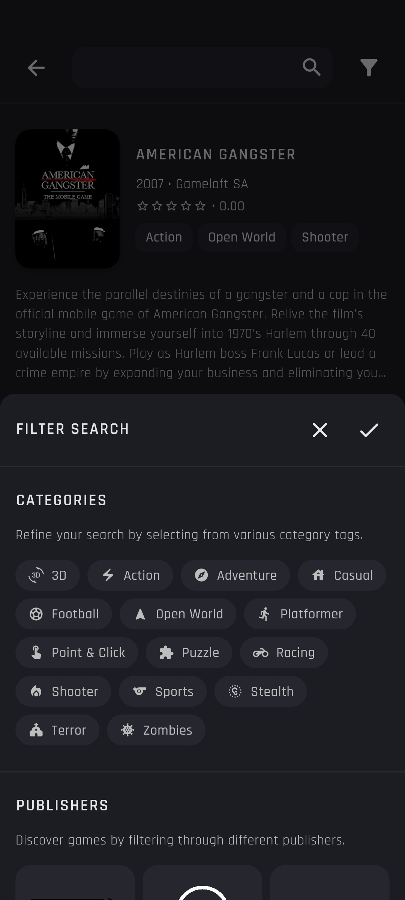
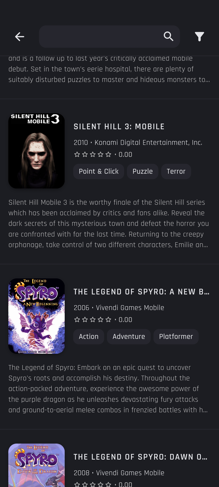

# MIDlet Store

MIDlet Store is a free and open-source project dedicated to preserving J2ME games on Android devices. Discover and play classic J2ME games directly through an integrated emulator, without the need for additional applications or complex setups.

### Features:
- **Immersive Experience:** Enjoy classic game soundtracks while you search for your next gameplay.
- **Advanced Filtering:** Combine filters by publisher or category tags to quickly find the exact game you're looking for.
- **One-Click Play:** Choose from multiple game versions and start playing instantly with a single click.

### Do I need to install any additional software?

The only application you need besides the **MIDlet Store** is the [J2ME Loader](https://github.com/nikita36078/J2ME-Loader) emulator to play the games. But don’t worry **MIDlet Store** will guide you through the setup process.